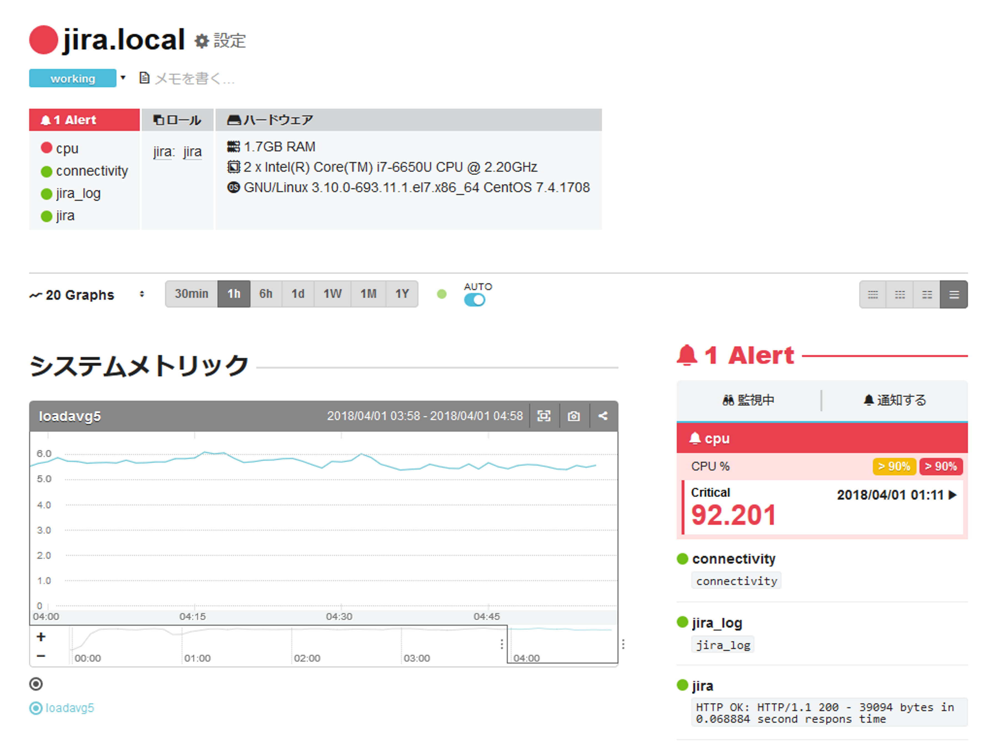
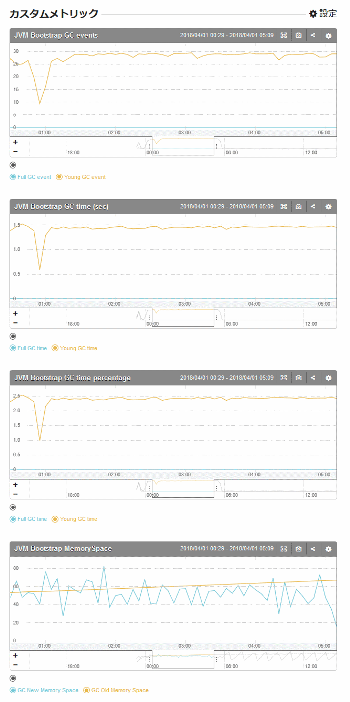
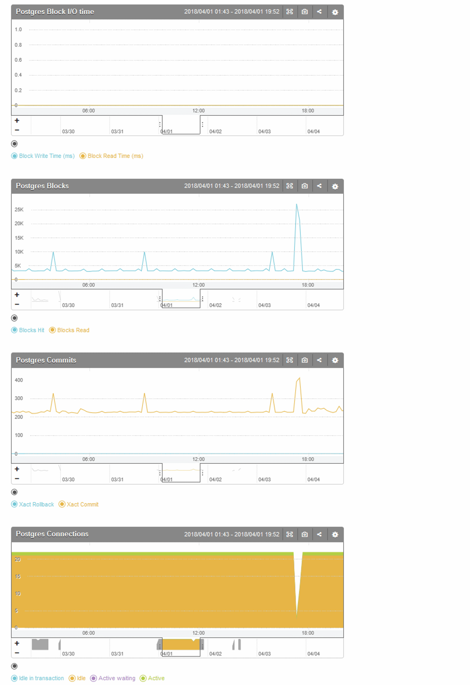

\lhead[]{}
\rhead[]{}
\chead[MackerelによるWebシステム監視]{MackerelによるWebシステム監視}

# MackerelによるWebシステム監視

この章では、アトラシアン社のJira Software(以降Jira)とバックエンドにPostgreSQLを
使用したWebシステムを題材として、MackerelによるWebサービスの監視の例について述べます。

## 標準メトリック

mackerel-agentのセットアップが完了してホストが登録された時点で、以下のメトリックは
標準メトリックとして取得可能です。([@fig:img_050_a0_image])

- ロードアベレージ
- CPU使用率
- メモリー
- ネットワークインターフェース
- ディスク使用量

{#fig:img_050_a0_image}


## メモリ使用率の表示について

mackerel-agent v0.54.0より、`/proc/meminfo`より`MemAvailable`が取得可能な
Linuxカーネルについては、`MemAvailable`を使用してメモリー使用量を表示するよう仕様が変更になりました。^[[https://mackerel.io/ja/blog/entry/announcement/20180323](https://mackerel.io/ja/blog/entry/announcement/20180323)]

このため、既存の環境([@fig:img_050_aa_image])と対象となる環境([@fig:img_050_ab_image])では、グラフの表示が異なります。


- 既存環境: used + buffers + cached + free = total
- 対象環境: used + available = total

{#fig:img_050_aa_image}

{#fig:img_050_ab_image}

なお、Red Hat Enterprise Linux(RHEL)6.6/CentOS6.6などの`MemAvailable`をバックポートしている
環境では、[@lst:code_050_code001]のように`/etc/sysctl.conf`に`vm.meminfo_legacy_layout = 0`を設定し、`sudo sysctl -p`コマンドで設定を反映する必要があります。

```{#lst:code_050_code001 caption="/etc/sysctl.conf"}
vm.meminfo_legacy_layout = 0
```

## 公式プラグインのセットアップ

Mackerelでは、各種ミドルウェアに対応した公式のプラグインが
オープンソースで^[[https://github.com/mackerelio/mackerel-agent-plugins](https://github.com/mackerelio/mackerel-agent-plugins)]提供されています。

インストールは、使用している環境に応じてyumレポジトリーないし
aptレポジトリーを使用します。mackerel-agentのセットアップ時に
スタートガイドに従って進めていれば、レポジトリーの設定は
行われていた状態になっています。

CentOSでのyumコマンドによる公式プラグインのインストール方法は、以下の通りと
なります。[@lst:code_050_code01]

```{#lst:code_050_code01 caption="公式プラグインのセットアップ"}
sudo yum install mackerel-agent-plugins
```

## TOML

Mackerelでは、`/etc/mackerel-agent/mackerel-agent.conf` にプラグインの設定を記述します。

`mackerel-agent.conf`では、TOMLという書式を使って、設定を記述します。

TOMLとは、GitHubの共同創設者であるThomas Preston-Werner氏が提唱した 
設定ファイルの記述フォーマットで、「Tom's Obvious, Minimal Language」の略です。

TOMLの仕様についてはGitHubのtoml-lang/tomlにあげられていますが、^[[https://github.com/toml-lang/toml](https://github.com/toml-lang/toml)]、ここでは`mackerel-agent.conf`を記述するうえで必要となるTOMLの要素について述べます。

### キーと値

設定するキーと値のペアは`key = value`の形式で記述します。文字列は二重引用符で囲みます。

### テーブル

[@lst:code_050_code0011]の`[table]`のように`[]`で囲った行はテーブルとして扱われ、それ以降はテーブルに属する項目として扱われます。

```{#lst:code_050_code0011 caption="TOMLの書式"}
[plugin.metrics.linux]
command = "mackerel-plugin-linux"
```

### インラインテーブル

[@lst:code_050_code0013]のように`{}`で囲まれたブロックはインラインテーブルとして扱われます。

```{#lst:code_050_code_0013 caption="インラインテーブル"}
action = { command="/usr/local/bin/restart-jira.sh" }
```

### コメント

\#で始まる行はコメントとなります。

### 複数行文字列

一つの項目に記述する文字列が長い場合は、[@lst:code_050_code0012]のように、`"""`で囲った文字列ブロック内で、行の末尾を`\`でつなげることで、複数行に分割して記述することができます。

```{#lst:code_050_code0012 caption="複数行文字列"}
[plugin.metrics.jvm]
command = """
mackerel-plugin-jvm -javaname=Bootstrap \
-jstatpath=/usr/java/default/bin/jstat \
-jpspath=/usr/java/default/bin/jps \
-jinfopath=/usr/java/default/bin/jinfo
"""
```
## mackerel-plugin-jvmによるJVMの監視

JiraはJava VM(以下JVM)上のTomcatで動作するWebアプリケーションですので、JVMへの監視項目を追加します。

`mackerel-agent.conf`の48行目近辺にJVMの監視である`mackerel-plugin-jvm`のための記述が
コメントされているので、これを編集します。[@lst:code_050_code02] [@lst:code_050_code021]

```{#lst:code_050_code02 caption="mackerel-plugin-jvmの初期設定"}
# [plugin.metrics.jvm]
# command = "mackerel-plugin-jvm -javaname=<required>"
```

```{#lst:code_050_code021 caption="mackerel-plugin-jvmの設定"}
[plugin.metrics.jvm]
command = "mackerel-plugin-jvm -javaname=Bootstrap"
```

javanameとは、`jps`コマンドを実行してホスト上で起動している
JVMのプロセス一覧を出力する際にプロセスを識別するもので、
通常はmainメソッドを実行しているクラスのクラス名が出力されます。

Tomcatでは起動時に`org.apache.catalina.startup.Bootstrap`クラスの
mainメソッドを実行するため、javanameは`Bootstrap`となります。

javanameに設定する値を知るには、ログインユーザー以外で
起動しているjavaプロセスも出力するために`sudo`をつけて`jps`コマンドを
実行します。[@lst:code_050_code03]

```{#lst:code_050_code03 caption="jpsコマンド"}
sudo jps -v |grep -v Jps
```

`jps`コマンドの出力は[@fig:img_050_a_image]の通りです。この出力の`BootStrap`がjavanameになります。

{#fig:img_050_a_image}

`mackerel-plugin-jvm` ではJVMのメトリックを収集するために
`jps` `jinfo` `jstat` のコマンドを使用します。起動している
JVMと同じインストール先のコマンドを使用するため、`alternatives`
コマンドを使用して設定を行います。[@lst:code_050_code04]

```{#lst:code_050_code04 caption="alternativesコマンド"}
sudo alternatives --set java /usr/java/jdk1.8.0_162/bin/java
sudo alternatives --set javac /usr/java/jdk1.8.0_162/bin/javac
```

サービスのjavaプロセスが`/usr/bin/java` のシンボリックリンクが差す
JDKと異なるJDKで起動している場合は、
`-jstatpath` `-jpspath` `-jinfopath`オプションでコマンドへのパスを指定します。[@lst:code_050_code05]

```{#lst:code_050_code05 caption="コマンドのパスの指定"}
[plugin.metrics.jvm]
command = """
mackerel-plugin-jvm -javaname=Bootstrap \
-jstatpath=/usr/java/default/bin/jstat \
-jpspath=/usr/java/default/bin/jps \
-jinfopath=/usr/java/default/bin/jinfo
"""
```

{#fig:img_050_jvm_image}

## mackerel-plugin-inodeによるinodeの監視

画像ファイルなどのストレージサーバーやバックアップサーバー、CI(継続的インテグレーション)サーバーなど、ディスクのパーテーションの容量に対してファイル数が多くなるサーバーは、ファイルシステム上の`inode`が枯渇する場合があります。inodeが枯渇すると、新しいファイルやディレクトリが作成できなくなります。

`inode`を監視するには、`mackerel-plugin-inode`を使用します。このプラグインを使用するには、`mackerel-agent.conf`に以下の設定を追記します。

```
[plugin.metrics.inode]
command = "mackerel-plugin-inode"
```


## PostgreSQLの監視

PostgreSQLは`mackerel-plugin-postgres`プラグインを使って監視を行います。

```{#lst:code_050_code06 caption="コマンドのパスの指定"}
[plugin.metrics.postgres]
command = "mackerel-plugin-postgres -user=jira -password=<password>"
```
`mackerel-plugin-postgres`のコマンドには`-database`というオプションがあります。
これは、PostgreSQLのインスタンスにログインする際、
ログインするユーザー名と同じデータベースが存在しない場合はデータベース名の指定が必要という、
`lib/pq` ^[[https://github.com/lib/pq](https://github.com/lib/pq)]の仕様によるものです。

このため、データベースの指定は`-user`オプションで指定しているユーザーが接続できるデータベースであれば
何でもよく、`-database`オプションの接続先がどこかは取得するメトリックに影響を及ぼしません。

{#fig:img_050_postgres_image}


## 監視の閾値

Mackerelでは、標準メトリックの監視について、アラートを送信する閾値のデフォルト値が
設定されていないため、監視条件となる閾値をユーザーが個別に設定する必要があります。

これは、メトリックの監視を行う上では、メトリックが
異常な状態であるという状態の定義は、ホストの性能や、ホストの性格によって
異なってくるためと考えられます。

例えば、ディスクの空き容量が10%であるという状況は、例えば、ディスクの容量が
8GBの場合と、1TBの場合では、その持つ意味あいが違います。ディスクの
容量が1TBの場合は、空き容量10%の場合におよそ100GBの空き容量があることになります。

また、CPU使用率は、演算処理を主に行うホストと、Webサーバーなどのホストでは、
CPU使用率が高止まりしていることの意味合いが異なってきます。

Susan J. Fowlerは、「Production-Ready Microservices」^[日本語訳「プロダクションレディマイクロサービス 運用に強い本番対応システムの実装と標準化」]([@Fowler2017])の中で、マイクロサービスの監視に求められる要件として、アラートに対してアクションが可能であることをあげています。

アクションが可能でないアラートとは、アラートがオンサイト技術者のもとに送付されても、サービスの持続性に対して大きな影響がない、アラートが伝えている問題に対して即時に対応可能な対応策がない、運用チームの所感でない外部のサービスの問題である、などです。

さて、Mackerelに限らず、多くの監視ソフトウェアやサービスでは、監視の閾値として、「Waring(警告)」「Critical(危険)」などの二段階の値を設定可能であり、Mackerelもそこにもれず、

