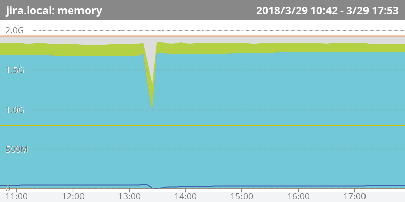
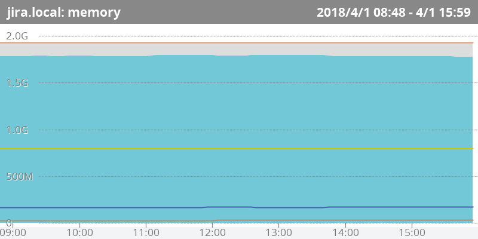
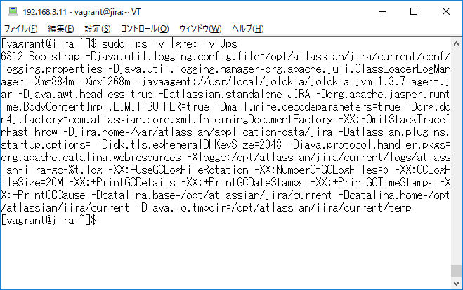

\lhead[]{}
\rhead[]{}
\chead[MackerelによるWebシステム監視]{MackerelによるWebシステム監視}

# MackerelによるWebシステム監視

この章では、アトラシアン社のJira Software(以降Jira)とバックエンドにPostgreSQLを
使用したシステムを題材として、MackerelによるWebサービスの監視の例について述べます。

## 標準メトリック

mackerel-agentのセットアップが完了してホストが登録された時点で、以下のメトリックは
標準メトリックとして取得可能です。

- ロードアベレージ
- CPU使用率
- メモリー
- ネットワークインターフェース
- ディスク使用量

## メモリ使用率の表示について

mackerel-agent v0.54.0より、`/proc/meminfo`より`MemAvailable`が取得可能な
Linuxカーネルについては、`MemAvailable`を使用してメモリー使用量を表示するよう仕様が変わりました。^[[https://mackerel.io/ja/blog/entry/announcement/20180323](https://mackerel.io/ja/blog/entry/announcement/20180323)]このため、既存の環境と対象となる環境では、グラフの表示が異なります。


- 既存環境([@fig:img_050_aa_image]): used + buffers + cached + free = total
- 対象環境([@fig:img_050_ab_image]): used + available = total


{#fig:img_050_aa_image}

{#fig:img_050_ab_image}

なお、RHEL6.6/CentOS6.6などの環境では、`/proc/meminfo`より`MemAvailable`を取得するには、[@lst:code_050_code001]のように`/etc/sysctl.conf`に`vm.meminfo_legacy_layout = 0`を設定し、`sysctl -p`コマンドで設定を反映する必要があります。

```{#lst:code_050_code001 caption="/etc/sysctl.conf"}
vm.meminfo_legacy_layout = 0
```

## 公式プラグインのセットアップ

Mackerelでは、各種ミドルウェアに対応した公式のプラグインが
オープンソースで^[[https://github.com/mackerelio/mackerel-agent-plugins](https://github.com/mackerelio/mackerel-agent-plugins)]提供されています。

インストールは、使用している環境に応じてyumレポジトリーないし
aptレポジトリーを使用します。mackerel-agentのセットアップ時に
スタートガイドに従って進めていれば、レポジトリーの設定は
行われていた状態になっています。

CentOSでのyumコマンドによる公式プラグインのインストール方法は、以下の通りと
なります。[@lst:code_050_code01]

```{#lst:code_050_code01 caption="公式プラグインのセットアップ"}
sudo yum install mackerel-agent-plugins
```

## TOML

Mackerelでは、`/etc/mackerel-agent/mackerel-agent.conf` にプラグインの設定を記述します。

`mackerel-agent.conf`では、TOMLという書式を使って、設定を記述します。

TOMLは、GitHubの共同創設者であるThomas Preston-Werner氏が提唱した 
設定ファイルの記述フォーマットで、「Tom's Obvious, Minimal Language」の略です。

TOMLの仕様についてはGitHubのtoml-lang/tomlにあげられていますが、^[[https://github.com/toml-lang/toml](https://github.com/toml-lang/toml)]、ここでは`mackerel-agent.conf`を記述するうえで必要となるTOMLの要素について述べます。

### キーと値

設定するキーと値のペアは`key = value`の形式で記述します。文字列は二重引用符で囲みます。

### テーブル

`[table]`のように`[]`で囲った行はテーブルとして扱われ、それ以降はテーブルに属する項目として扱われます。

```{#lst:code_050_code0011 caption="TOMLの書式"}
[plugin.metrics.linux]
command = "mackerel-plugin-linux"
```

### コメント

\#で始まる行はコメントとなります。

### 複数行文字列

一つの項目に記述する文字列が長い場合は、[@lst:code_050_code0012]のように、`"""`で囲った文字列ブロック内で、行の末尾を`\`でつなげることで、複数行に分割して記述することができます。

```{#lst:code_050_code0012 caption="複数行文字列"}
[plugin.metrics.jvm]
command = """
mackerel-plugin-jvm -javaname=Bootstrap \
-jstatpath=/usr/java/default/bin/jstat \
-jpspath=/usr/java/default/bin/jps \
-jinfopath=/usr/java/default/bin/jinfo
"""
```
## mackerel-plugin-jvmによるJVMの監視

JiraはJava VM上のTomcatで動作するWebアプリケーションですので、JVMへの監視項目を追加します。

`mackerel-agent.conf`の48行目近辺にJVMの監視である`mackerel-plugin-jvm`のための記述が
コメントされているので、これを編集します。[@lst:code_050_code02] [@lst:code_050_code021]

```{#lst:code_050_code02 caption="mackerel-plugin-jvmの初期設定"}
# [plugin.metrics.jvm]
# command = "mackerel-plugin-jvm -javaname=<required>"
```

```{#lst:code_050_code021 caption="mackerel-plugin-jvmの設定"}
[plugin.metrics.jvm]
command = "mackerel-plugin-jvm -javaname=Bootstrap"
```

javanameとは、`jps`コマンドを実行してホスト上で起動している
JVMのプロセス一覧を出力する際にプロセスを識別するもので、
通常はmainメソッドを実行しているクラスのクラス名が出力されます。

javanameに設定する値を知るには、ログインユーザー以外で
起動しているjavaプロセスも出力するために`sudo`をつけて`jps`コマンドを
実行します。[@lst:code_050_code03]

```{#lst:code_050_code03 caption="jpsコマンド"}
sudo jps -v |grep -v Jps
```

`jps`コマンドの出力は以下の通りです。[@fig:img_050_a_image]この出力の`BootStrap`がjavanameになります。

{#fig:img_050_a_image}

`mackerel-plugin-jvm` ではJVMのメトリックを収集するために
`jps` `jinfo` `jstat` のコマンドを使用します。起動している
JVMと同じインストール先のコマンドを使用するため、`alternatives`
コマンドを使用して設定を行います。[@lst:code_050_code04]

```{#lst:code_050_code04 caption="alternativesコマンド"}
sudo alternatives --set java /usr/java/jdk1.8.0_162/bin/java
sudo alternatives --set javac /usr/java/jdk1.8.0_162/bin/javac
```

サービスのjavaプロセスが`/usr/bin/java` のシンボリックリンクが差す
JDKと異なるJDKで起動している場合は、
`-jstatpath` `-jpspath` `-jinfopath`オプションでコマンドへのパスを指定します。[@lst:code_050_code05]

```{#lst:code_050_code05 caption="コマンドのパスの指定"}
[plugin.metrics.jvm]
command = """
mackerel-plugin-jvm -javaname=Bootstrap \
-jstatpath=/usr/java/default/bin/jstat \
-jpspath=/usr/java/default/bin/jps \
-jinfopath=/usr/java/default/bin/jinfo
"""
```


## PostgreSQLの監視

PostgreSQLは`mackerel-plugin-postgres`を使って監視を行います。

```{#lst:code_050_code06 caption="コマンドのパスの指定"}
[plugin.metrics.postgres]
command = "mackerel-plugin-postgres -user=jira -password=<password>"
```
`mackerel-plugin-postgres`のコマンドには`-database`というオプションがあります。
これは、データベースのインスタンスにログインする際、
ユーザー名と同じデータベースが存在しない場合はデータベース名の指定が必要という、
`lib/pq` ^[[https://github.com/lib/pq](https://github.com/lib/pq)]の仕様によるものです。


## 監視の閾値
