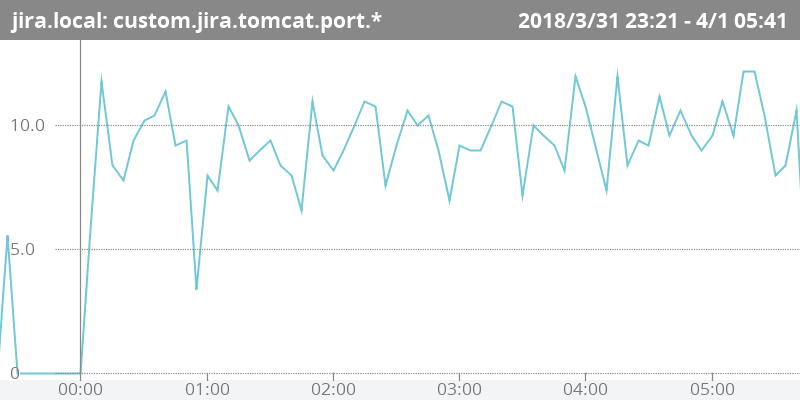

\lhead[]{}
\rhead[]{}
\chead[プラグイン開発による対象メトリックの追加]{プラグイン開発による対象メトリックの追加}

# プラグイン開発による対象メトリックの追加

Mackerelの特徴の一つとして、プラグインを開発することによる、
カスタムメトリクスやチェック監視の追加が容易な事があげられます。

mackerel-agentとプラグインの間は、プラグインとして実行したコマンドの
返り値および標準出力によって結果の受け渡しを行います。

このため、特定のプログラミング言語に依存せずにプラグインの実装を行う事ができます。Mackerelの公式プラグイン ^[[https://github.com/mackerelio/mackerel-agent-plugins](https://github.com/mackerelio/mackerel-agent-plugins)] はGo言語で実装されていますが、
Rubyやシェルスクリプトなど、コマンドの返り値と標準入出力の概念を有しているプログラミング言語であればどれでもプラグインの開発が可能です。

特定のプログラミング言語に依存せずにプラグインの実装を行う事ができることのメリットは、現場の技術者が有しているスキルセットを活用してプラグインの
開発を行う事ができることです。

これは、ITサービスの運用の現場では使用できる技術セットに限りがあるためです。

現場によって使用できる技術セットは、「シェルスクリプトならできる」「RubyならServerspecを使っているからわかる」など、現場ごとにばらつきがあります。

このことは運用に従事する技術者がソフトウェア技術者でない以上避けられないことです。また運用のために構築するスクリプトは、ビジネス価値に直結する
プロダクションコードでないため、サービス構築は目的でなく手段の位置づけになります。

このような時に、Mackerelでは、新しい技術セットを導入することなしに
現場が持っている技術セットを活用してサービス監視のために必要な構築プロセスを進めることができます。

## プラグインによるメトリック監視

Tomcatでは、同時に処理を行うことができるhttpの接続数は
`server.xml`で指定するスレッドプールの上限数によって決定します。

このため、スレッドプールの上限と同時接続数のバランスを監視する必要があります。

[@lst:code_060_code01]に示すのは、Jiraが稼働しているTomcat上でのhttpの同時接続数を
メトリックとして集計するプラグインです。

```{#lst:code_060_code01 caption="/usr/local/bin/jiraport"}
#!/bin/bash

EST=$(ss -nat |grep 192.168.3.11:8080 |grep ESTAB |wc -l)
EPOCH=$(date +'%s')

echo -e "jira.tomcat.port.establish\t${EST}\t${EPOCH}"
```

このスクリプト内で`echo`コマンドに`-e`コマンドを指定しているのは、
`\t`のエスケープシーケンスをタブ文字として出力するためのものです。

また、出力内で`EPOCH`として出力しているものは、1970-01-01 00:00:00 UTC からの秒数
であり、いわゆるUNIX EPOCHです。Mackerel上でグラフの時系列の組み立てに用いられます。

Mackerelのプラグインでは、[@lst:code_060_code02]のフォーマットで標準出力にメトリックを出力します。

```{#lst:code_060_code02 caption="メトリックの出力フォーマット"}
{metric name}\t{metric value}\t{epoch seconds}
```

このコマンドを実行すると、[@lst:code_060_code03]の出力が`mackerel-agent`を通してMackerelに送られます。

```{#lst:code_060_code03 caption="プラグインの実行結果"}
jira.tomcat.port.establish      10      1522506338
```

この際、`jira.tomcat.port.establish` の名前の最後のドットまでが共通するメトリックがひとつのグラフにまとめられます。


プラグインの実行は、`mackerel-agent.conf`で実行するコマンドを記述します。([@lst:code_060_code04])

```{#lst:code_060_code04 caption="mackerel-agent.confの設定"}
[plugin.metrics.jiraport]
command = "/usr/local/bin/jiraport"
```

以上の設定を行うと、Mackerel上では、[@fig:img_060_a_image]の様なグラフが出力されます。

{#fig:img_060_a_image}

## 環境変数

プラグインの動作確認のために、システムのシェルから実行を
行っている場合と、`mackerel-agent`のサービスからプラグインを実行している場合は、`LANG`や`PATH`など、環境変数の違いにより実行した結果が変わってくる場合があります。

この場合は`mackerel-agent.conf`の`env`テーブルで、実行時の環境変数を指定することができます。

[@lst:code_060_code05]および[@lst:code_060_code06]は、[@lst:code_060_code01]のスクリプト内でハードコーディングしていたホストのアドレスを、環境変数として設定するようにしたものです。

```{#lst:code_060_code05 caption="環境変数の指定の例"}
[plugin.metrics.jiraport]
command = "/usr/local/bin/jiraport"
env = { HOST = "192.168.3.11" }
```

```{#lst:code_060_code06 caption="/usr/local/bin/jiraport(修正後)"}
#!/bin/bash

EST=$(ss -nat |grep ${HOST}:8080 |grep ESTAB |wc -l)
EPOCH=$(date +'%s')

echo -e "jira.tomcat.port.establish\t${EST}\t${EPOCH}"
```
