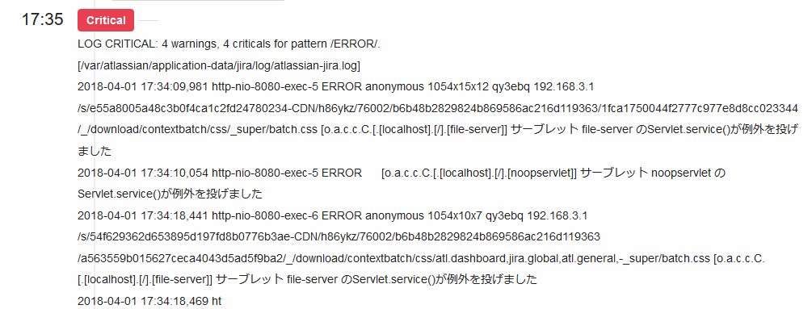
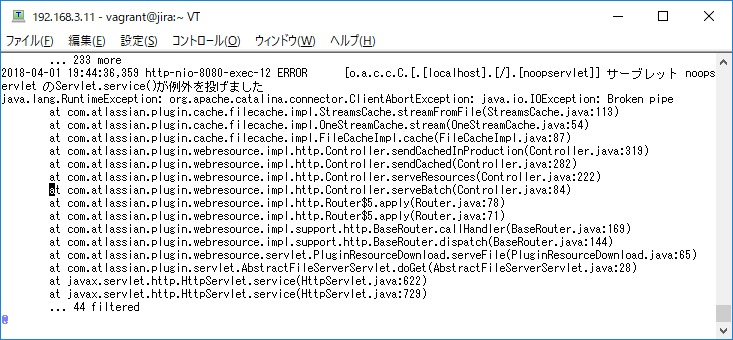
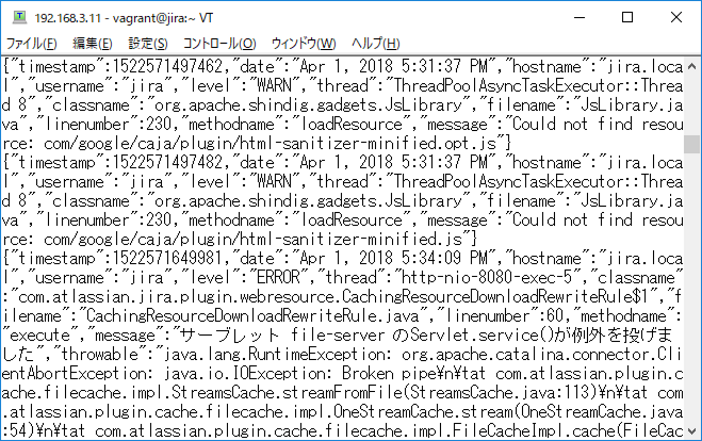

\lhead[]{}
\rhead[]{}
\chead[チェック監視について]{チェック監視について}

# チェック監視について

ここまで紹介してきた、同時接続数や、サーバーのさまざまなリソースの状況など、
サーバー上のメトリックを時系列にそって監視する方法をメトリック監視と呼びます。

これに対し、サーバーのヘルスチェックの状況や、ログファイル内のエラーログ出力
など、サーバー上の時系列によらない個別のステータスをチェックした結果の監視を
行う監視を、Mackerelではチェック監視と呼んでいます。

## メトリック監視とチェック監視

以前は、監視と言えばチェック監視が中心でした。以前はITサービス運用の
可用性への要求も高くなく、サービスのダウンを検知したらサーバーを再起動したり、
待機系に切り替えるなどの運用がまかり通っていたためです。

またさまざまなメトリックを時系列で取得するには、ディスク領域や監視に用いる
サーバーの処理性能などの制約があったこともあります。

しかしITサービスの社会への普及やサーバー仮想化やパブリッククラウドの普及
などにより、単純なサービスのヘルスチェックだけでなく、アクセス負荷の変化
によるスケールアウト・スケールインなど、サービスを通したメトリックへの監視の
ニーズが高まってきました。また、技術面の向上やハードウェア性能の向上などに
より、以前は難しかったメトリックの監視を中心に据えた監視システムの運用が
可能になってきました。

この流れに則り、Mackerelもメトリック監視を中心に据えた設計になっています。

しかしエラーログの監視や外形監視などのサービスのエンドポイントやヘルスチェックの
監視など、メトリックによらない監視へのニーズも依然として存在しています。
この場合はチェック監視の機能を用いた監視を行います。

## check-httpプラグインによる死活監視

Mackerelでは、チェック監視に対応した公式プラグイン集がOSSとして^[[https://github.com/mackerelio/go-check-plugins](https://github.com/mackerelio/go-check-plugins)]提供されています。

インストールは、`yum`コマンドないし`apt`コマンドで行います。[@lst:code_070_code_01]

```{#lst:code_070_code_01 caption="プラグインのインストール"}
sudo yum install mackerel-check-plugins
```

各プラグインのコマンドは`/usr/bin/`以下にインストールされます。

各プラグインのコマンドの仕様に則ってmackerel-agent.confに設定を行います。

[@lst:code_070_code_02]は、`check-http`プラグインを使って、Jiraサーバーに対して
httpのヘルスチェックを行う設定例です。


```{#lst:code_070_code_02 caption="mackerel-agent.conf"}
[plugin.checks.jira]
command = "check-http -u http://localhost:8080/"
check_interval = 3
action = { command="/usr/local/bin/restart-jira.sh" }
```

ブロックの先頭の`[plugin.checks.jira]`がMackerel上で監視項目を識別する
キーになります。

チェック監視の場合は、キー名は`plugin.checks`ではじまり、
含まれるドットの数は2つである(三階層)である必要があります。

チェック監視では、`action`項目で、監視の閾値の条件に該当する際に、
実行するコマンドを記述することができます。

[@lst:code_070_code_03]は、この機能を使って、
httpのヘルスチェックに失敗した際にサービスの自動再起動を行うサンプルです。

\begin{codelisting}
\caption{restart-jira.sh}
\hypertarget{lst:code070code06}{\label{lst:code070code06}}
\verbatimfont{\small}%
\begin{verbatim}
#!/bin/bash

if [ -z $MACKEREL_STATUS ]; then
  exit 0
fi
if [ -z $MACKEREL_PREVIOUS_STATUS ]; then
  exit 0
fi
set -ux
set +e
if [ $MACKEREL_PREVIOUS_STATUS = "CRITICAL" -a $MACKEREL_STATUS = "CRITICAL" ]; then
  PID=$(ps aux |grep java |grep Bootstrap |grep jira |awk '{print $2}')
  kill -9 $PID
  systemctl start jira
fi
\end{verbatim}
\end{codelisting}

環境変数の`MACKEREL_PREVIOUS_STATUS`と`MACKEREL_STATUS`にはチェック監視の結果が格納されています。

[@lst:code_070_code_03]では、一回前のチェック監視の結果である`MACKEREL_PREVIOUS_STATUS`と直前のチェック監視の結果である`MACKEREL_STATUS`がともに`CRITICAL`の場合にサービス再起動を行います。

即ち、2回連続でヘルスチェックの実行に失敗した場合にサービスの自動再起動を行います。

再起動している間もヘルスチェックは継続しているので、`check_interval`で定義された
次のチェックまでの間隔(この場合3分)までにサービスの起動が完了してヘルスチェックが成功するようになっている必要があります。

## check-logプラグインによるログ監視

[@lst:code_070_code_04]は、`check-log`プラグインを使ってエラーログの監視を行う設定例です。

```{#lst:code_070_code_04 caption="check-logプラグインによる監視"}
[plugin.checks.jira_log]
command = "check-log --file /var/atlassian/application-data/jira/log/atlassian-jira.log --pattern ERROR --return"
prevent_alert_auto_close = true
```

`command`に`--return`オプションを付与することにより、[@fig:img_070_01_image]の画面の出力のようにMackerelにエラーログの内容を
出力することができます。この際は認証情報やユーザーの個人情報などがログ内に出力されない
ように留意する必要があります。

{#fig:img_070_01_image}

`check-log`プラグインを使ってログの監視を行っている際、ログファイル内のキーワードの出現を1行ごとにおこなっているため、`check-log`コマンドがログファイルの次の行を読みこんだ時点で、OKの復旧報がエラーの発生直後に通知されます。

復旧報を抑止するためには、[@lst:code_070_code_04]の例のように、`mackerel-agent.conf`の設定に`prevent_alert_auto_close = true`を設定します。

## プラグイン開発によるチェック監視

Mackerelのチェック監視の仕様は、NagiosやSensuなどのチェック監視の仕様に準拠しています。

この仕様に則ることで独自のチェック監視項目を追加することができます。

プラグインの仕様は、

- コマンドの終了コードが`0`の場合は正常終了、`1`の場合は`WARINING`,
`2`の場合は`CRITICAL`。
- 標準出力はメッセージとしてMackerelに送られる

というもので、コマンドの終了コードと標準出力を使ってチェック監視を行います。


[@lst:code_070_code_05]と[@lst:code070code06] は、[@lst:code_070_code_02]で行っていたサーバーの
ヘルスチェックの監視を、プラグインを使って行うものです。


- 1分ごとにヘルスチェックを実行し、ヘルスチェックが失敗した場合は`WARNING`を出力
- 10回連続でヘルスチェックに失敗した場合はサービス再起動
- 再起動時にヘルスチェックの失敗回数は初期化する

という処理を行っています。


```{#lst:code_070_code_05 caption="独自プラグインによる監視"}
[plugin.checks.jira2]
command = "/usr/local/bin/restart-jira-plugin.sh"
check_interval = 1
```

\begin{codelisting}
\caption{独自プラグインによる監視}
\hypertarget{lst:code070code06}{\label{lst:code070code06}}
\verbatimfont{\small}%
\begin{verbatim}
#!/bin/bash
set -ux
FILE=/var/lib/mackerel-agent/jira
if [ -f ${FILE} ]; then
  COUNT=$(cat ${FILE})
else
  COUNT=0
fi
OUT=$(curl -f http://localhost:8080 2>&1)
RET=$?
if [ $RET -eq 0 ]; then
  echo 0 > ${FILE}
  exit 0
else
  echo $OUT
  COUNT=$(( COUNT + 1 ))
  echo ${COUNT} > ${FILE}
fi
if [ $COUNT -gt 10 ]; then
  echo $OUT
  rm -f ${FILE}
  PID=$(ps aux |grep java |grep Bootstrap \
  |grep jira |awk '{print $2}')
  kill -9 $PID
  systemctl start jira
  exit 2
fi
\end{verbatim}
\end{codelisting}

## JSON形式でのログ出力によるチェック監視の設定

ここまで述べてきたように`check-log`監視ではログファイルのチェックを行単位で行うようになっていますが、[@fig:img_070_021_image]のようにプログラムのスタックトレースの出力は複数行を1レコードとして出力されるため、チェック監視の条件を設定する上で複数行をまとめて読み込む必要がある場合があります。

[@fig:img_070_02_image]および[@lst:code_070_code_08]は、JSON形式でのログ出力を行う事で、スタックトレース内に`ClientAbortException`という文字列が含まれる場合は監視から除外する設定例です。
 
{#fig:img_070_021_image}

{#fig:img_070_02_image}

```{#lst:code_070_code_08 caption="JSON形式でのログ監視"}
[plugin.checks.jira_log]
command = """
check-log \
--file \
/var/atlassian/application-data/jira/log/jira.log.json \
--pattern ERROR --exclude ClientAbortException --return
"""
prevent_alert_auto_close = true
```


