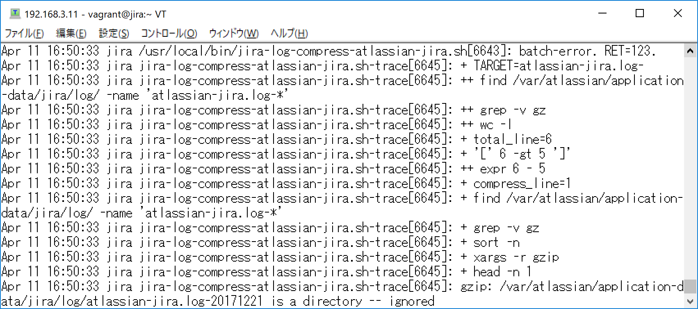
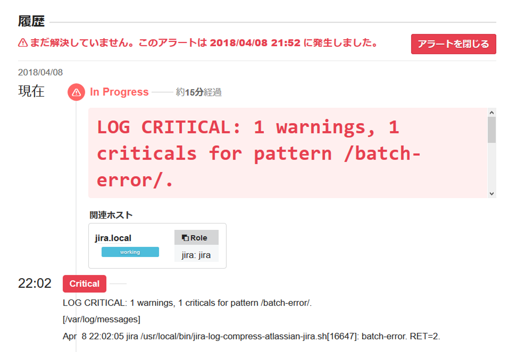

\mbox{}
\newpage

\lhead[]{}
\rhead[]{}
\chead[バッチ処理のロギングと監視]{バッチ処理のロギングと監視}


# バッチ処理のロギングと監視

Linuxサーバーにおいてcronによるバッチ処理は未だにシステム構築で
重要な地位を占めています。バックアップ処理やログファイルのアーカイブ・ローテーションなどです。

バッチ処理は、エンドユーザーに対してユーザーインターフェースを持ちません。このため、実行の結果を確認するために、実行結果やログに対する監視は重要な地位を占めます。

しかし、モダンなプログラミング言語やフレームワーク上でのシステム開発と比べて、シェルスクリプトを基調としたシステムの監視・運用は難易度が高いものとなっています。

それは、例外処理やロギングフレームワーク、エラー発生時のスタックトレース出力など、モダンなフレームワークが有している機能をシェルスクリプトが有していないためです。このような運用に必要な仕組みをフルスクラッチで作り込むことは、構築と運用に関するコストのバランスが悪いバッチ処理を生み出します。

本章では、シェルスクリプトを基調としたバッチ処理において、OSが提供する枠組みの中で運用に必要な仕組みを作り込み、Mackerelでの監視に組み込む仕組みについて述べます。

## バッチ処理の監視に必要な要素

### 例外処理

特にオプションを付与していないシェルスクリプトには、個々のコマンド実行ごとにエラーハンドリングが必要ですが、実装時の負担が大きいため、`-e`/`-u`オプションで、エラー発生や未定義変数の参照を補足できるようにします。

この際に、呼び出し先のメインのスクリプトに`-e`オプションを付与すると、エラー発生時にスクリプトの実行が打ち切られてしまうため、処理全体に対する結果のハンドリングができなくなります。メイン処理となるスクリプトと、そこから呼び出される処理を実装するスクリプトを分割し、処理を実装するスクリプトに`-e`オプションを付与することで、結果のハンドリングができるようにします。

### ロギング

ログについては、`logger`コマンドを使用してsyslogに集約します。

この際に、先述の実装するスクリプトではログは全て標準出力に`echo`コマンドで出力したものを`logger`コマンドで出力することで、スクリプトのログ出力の実装を単純にします。

### エラー発生時のスタックトレース

シェルスクリプトにはスタックトレースという機能が存在しませんが、`-x`オプションの出力を標準エラー出力で補足してエラー発生時にログ出力することで、処理をトレース可能にします。

### 監視

監視は、syslogの出力をMackerelでチェック監視することで行います。

## 実装例

以下に示す処理は、Jiraの出力するログファイルを、5世代以上前のファイルは圧縮するバッチ処理です。

### メイン処理

[@lst:code075_code01]のスクリプトがメイン処理の実装です。

処理内で標準出力をログ出力として、標準エラー出力を`-x`オプションによるトレースの出力として取得します。

スクリプトの終了コードによって結果を判定し、ログの出力を行います。`logger`コマンドの`-t`オプションに`$0`によるスクリプト名を埋め込むことで、ログ出力内で、スクリプトの区別がつくようにしています。

\begin{codelisting}
\caption{メイン処理(jira-log-compress-atlassian-jira.sh)}
\hypertarget{lst:code075_code01}{\label{lst:code075_code01}}
\verbatimfont{\small}%
\begin{verbatim}
#!/bin/bash

set -u

output=$(mktemp)
error=$(mktemp)

/usr/local/bin/jira-log-compress.sh "atlassian-jira.log-" 1>${output} 2>${error}
RET=$?
cat $output |logger -is -t $(basename $0)

if [ $RET -eq 0 ]; then
    logger -is -t $(basename $0) "successful end."
else
    logger -is -t $0 "batch-error. RET=${RET}."
    cat $error |logger -is -t $(basename $0)-trace
fi

rm $output
rm $error
\end{verbatim}
\end{codelisting}

### 処理の実装

[@lst:code075_code02]のスクリプトが、[@lst:code075_code01]から呼び出される処理になります。

スクリプト内で`-e`と`-u`オプションをエラー処理のために設定しています。また`-x`オプションでスクリプトのトレースができるようにしています。

`echo`コマンドによる標準出力への出力は、ログメッセージとして使用しています。

\begin{codelisting}
\caption{実装(jira-log-compress.sh)}
\hypertarget{lst:code075_code02}{\label{lst:code075_code02}}
\verbatimfont{\small}%
\begin{verbatim}
#!/bin/bash
set -eux

TARGET=$1

total_line=$(find /var/atlassian/application-data/jira/log/ \
  -name "${TARGET}*" |grep -v gz |wc -l)

if [ $total_line -gt 5 ]; then
  compress_line=`expr $total_line - 5`
  find  /var/atlassian/application-data/jira/log/ \
    -name "${TARGET}*" |grep -v gz | \
    sort -n |head -n ${compress_line} |xargs  -r gzip
  echo "compress ${compress_line} files."
  exit 0
fi
echo "(no target)." 
 
\end{verbatim}
\end{codelisting}

### syslogの設定

処理のトレースなどでsyslogの出力が増えることにより、syslogのデフォルト設定では出力の取りこぼしが発生します。

これに対応するために、[@lst:code_075_code_03]のように`/etc/rsyslog.conf`に、`$SystemLogRateLimitInterval 0`を追記します。

```{#lst:code_075_code_03 caption="/etc/rsyslog.conf"}
$SystemLogRateLimitInterval 0
```

### check-logの設定

[@lst:code_075_code_04]のように`/etc/mackerel-agent/mackerel-agent.conf`に`check-log`プラグインの設定を追加します。`--exclude mackerel-agent`を指定しているのは、`mackerel-agent.conf`で`verbose = true`を指定しているときに、`mackerel-agent`自体のログ出力が`check-log`の監視ルールの条件に該当してしまうためです。

```{#lst:code_075_code_04 caption="syslogのチェック監視"}
[plugin.checks.batch_log]
command = """
check-log --file /var/log/messages \
--pattern batch-error --exclude mackerel-agent --return
"""
prevent_alert_auto_close = true
```

[@lst:code_075_code_05]は、処理が正常に終了した場合の`/var/log/messages`の出力です。

```{#lst:code_075_code_05 caption="実行終了時"}
Apr 11 16:47:20 jira jira-log-compress-atlassian-jira.sh[6004]: compress 19 files.
Apr 11 16:47:20 jira jira-log-compress-atlassian-jira.sh[6007]: successful end.
```


{#fig:img_075_a_image}

{#fig:img_075_b_image}

[@fig:img_075_a_image]および[@fig:img_075_b_image]は、圧縮するファイル名と
同じパターンのディレクトリーが存在するために、スクリプトの実行に失敗している場合の`/var/log/messages`への出力ならびに、Mackerel上でのチェック監視のアラートの様子です。