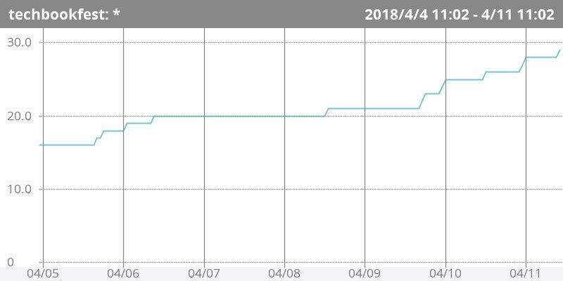
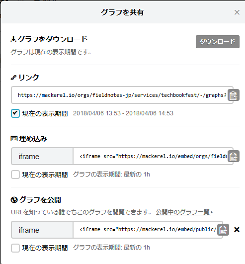
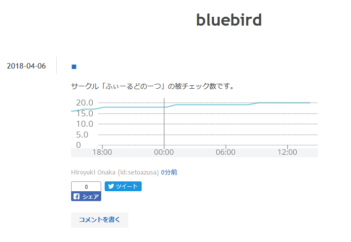
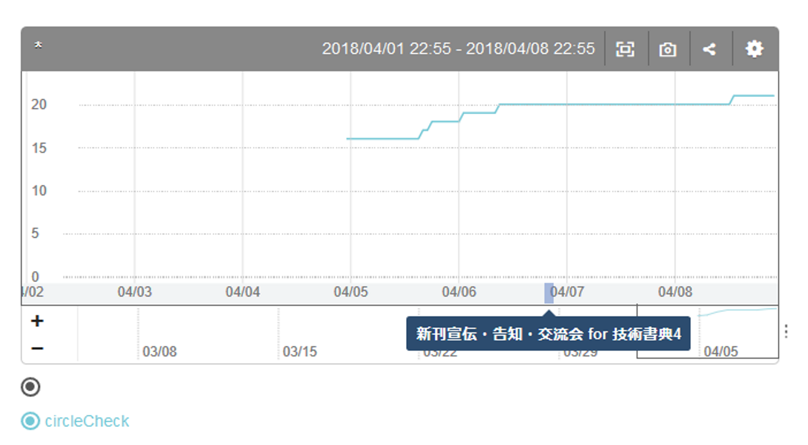
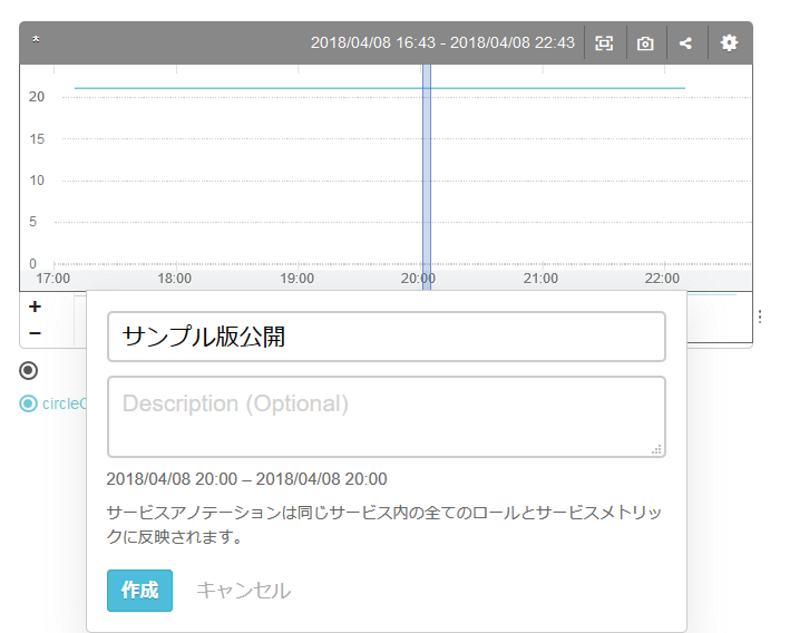

\mbox{}
\newpage

\lhead[]{}
\rhead[]{}
\chead[サービスメトリック]{サービスメトリック}

# サービスメトリック

## サービスメトリックについて

アプリケーションのメトリックや、売上やページビューなどのビジネス指標等、特定のホストに関連付かない
メトリックをMackerelではサービスメトリックと呼称します。

サービスメトリックの投稿は、[@lst:code_080_a]のように、Mackerelが提供しているAPI^[[https://mackerel.io/ja/api-docs/](https://mackerel.io/ja/api-docs/)]にhttpsでPOSTすることによって行います。

POSTするURLは`/api/v0/services/<サービス名>/tsdb`です。

POSTのbodyのJSONは

- name: メトリックの名称
- time: UNIX EPOCH
- value: メトリックの値

からなるオブジェクトの配列です。

\begin{codelisting}
\caption{サービスメトリックの投稿}
\hypertarget{lst:code_080_a}{\label{lst:code_080_a}}
\verbatimfont{\small}%
\begin{verbatim}
 curl -v https://api.mackerelio.com/api/v0/services/techbookfest/tsdb \
 -H 'X-Api-Key: <APIキー>' \
 -H 'Content-Type: application/json' -X POST \
 -d '[{"name": "circleCheck", "time": '$(date +%s)', "value": 16}]'
\end{verbatim}
\end{codelisting}

[@lst:code_080_a]は、著者が主宰するサークルの技術書典のサークルリストのページ^[[https://techbookfest.org/event/tbf04/circle](https://techbookfest.org/event/tbf04/circle)]での被チェック数をサービスメトリックとして
投稿するcurlコマンドの例です。

サービスメトリックを作成すると、[@fig:img_080_a]のグラフが作成されます。

{#fig:img_080_a}

### APIのドメイン

MackerlのAPI呼び出しのドメインは`api.mackerelio.com`です。これは、当初は`mackerel.io`を
使用していたものが、`.io`ドメインの権威DNSサーバーの不調に伴うサービスへの影響 ^[[https://mackerel.io/ja/blog/entry/announcement/20170921](https://mackerel.io/ja/blog/entry/announcement/20170921)]を受けて、`api.mackerelio.com`に変更になったもの ^[[https://mackerel.io/ja/blog/entry/weekly/20171006](https://mackerel.io/ja/blog/entry/weekly/20171006)]です。

## Azure Functionsによるサービスメトリック作成

[@lst:code_080_b]に示すのは、Azure FunctionsのTimerTriggerを使用して、[@lst:code_080_a]と同じく
技術書典のサークルの被チェック数を取得してMackerelにサービスメトリックとして送信するTypeScriptのスクリプトの抜粋です。^[コードの全体は[https://github.com/azusa/circlecheck-mackerel](https://github.com/azusa/circlecheck-mackerel)で公開しています。]

\begin{codelisting}
\caption{Azure Functionsによるサービスメトリック投稿}
\hypertarget{lst:code_080_b}{\label{lst:code_080_b}}
\verbatimfont{\small}%
\begin{verbatim}
const sendToMackerel = async checkedCount => {
    const opt = {
        method: 'POST',
        uri: 
        'https://api.mackerelio.com/api/v0/services/techbookfest/tsdb',
        body: JSON.stringify(
          [{ name: "circleCheck",
             time: Math.floor(new Date().getTime() / 1000),
             value: checkedCount }]),
        headers: {
          'content-type': 'application/json',
          'X-Api-Key': apiKey
        },
        resolveWithFullResponse: true
      }
    await rp(opt)
}
\end{verbatim}
\end{codelisting}

## グラフの共有

Mackerelでは、URLを共有する形式で、グラフを共有することができます。

ConfluenceをはじめとするCMSやWiki、ブログなどの、
画像の埋め込みやHTMLのiframeおよびMarkdownを使うことのできるWebサービス上で、
[@fig:img_080_b]のようにコンテンツ内にグラフを埋め込むことができます。

このことにより、組織内の業務で日常的に訪れるサイト内にグラフを埋め込む
ことで、組織全体でメトリックの共有をすることができます。

{#fig:img_080_b}

[@fig:img_080_c]はこの機能を使って、はてなブログ内にMarkdownにより
Mackerelのメトリックのグラフを埋め込んでいる様子です。

{#fig:img_080_c}

## サービスアノテーション

Mackerelにはグラフに時系列に沿った注釈を付与するサービスアノテーションという
機能があります。

[@fig:img_080_d]のようにサービスアノテーションを使用することにより、アプリケーションのリリースや、ビジネス施策の展開など、ITサービス運用の中で起きた出来事と、メトリックの関連を可視化することができます。

{#fig:img_080_d}

サービスアノテーションを付与するには、[@fig:img_080_e]のようにグラフのラベルの日時を表示しているラベルの部分をクリックし、ポップアップでアノテーションの内容を記述します。

{#fig:img_080_e}

余談ですが、会員数などのビジネス目標の達成を告知するために、監視ルールを設定する場合があります。
この場合、会員数が目標値を上回るとアラートが発生し、目標値を再度下回ると、そのアラートがクローズします。

これはホストメトリックの通知に関する「値が閾値を超えた場合は異常」という概念を流用したため
目標を達成したことに対して「アラートが発生する」、という見え方になっているわけです。
当然ながらビジネス的には望ましいことですので、新たな目標値を設定して監視条件を更新しましょう。
