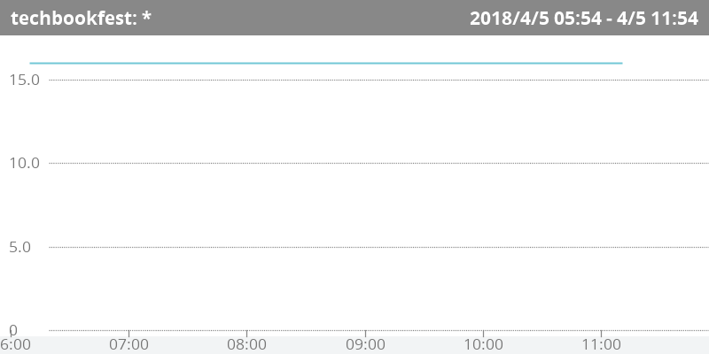

\thispagestyle{empty}
\mbox{}
\newpage
\clearpage


\lhead[]{}
\rhead[]{}
\chead[サービスメトリック]{サービスメトリック}


# サービスメトリック

アプリケーションのメトリックや、売上やページビューなどのビジネス指標等、特定のホストに関連付かない
メトリックをMackerelではサービスメトリックと呼称します。

サービスメトリックは、[@lst:code_080_a]のように、Mackerelが提供しているAPI^[[https://mackerel.io/ja/api-docs/](https://mackerel.io/ja/api-docs/)]にhttpsでPOSTすることによって行います。

POSTするURLは`/api/v0/services/<サービス名>/tsdb`です。

POSTのbodyのJSONは

- name: メトリックの名称
- time: UNIX EPOCH
- value: メトリックの値

からなるオブジェクトの配列です。

```{#lst:code_080_a caption="サービスメトリックのPOST"}
 curl -v https://api.mackerelio.com/api/v0/services/techbookfest/tsdb \
 -H 'X-Api-Key: <APIキー>' \
 -H 'Content-Type: application/json' -X POST \
 -d '[{"name": "circleCheck", "time": '$(date +%s)', "value": 16}]'
```

サービスメトリックを作成すると、[@fig:img_080_a]のグラフが作成されます。

{#fig:img_080_a}

### APIのドメイン

MackerlのAPI呼び出しのドメインは`api.mackerelio.com`です。これは、当初は`mackerel.io`を
使用していたものが、`.io`ドメインの権威DNSサーバーの不調に伴うサービスへの影響 ^[[https://mackerel.io/ja/blog/entry/announcement/20170921](https://mackerel.io/ja/blog/entry/announcement/20170921)]を受けて、`api.mackerelio.com`に変更になったもの ^[[https://mackerel.io/ja/blog/entry/weekly/20171006](https://mackerel.io/ja/blog/entry/weekly/20171006)]です。

## Azure Functionsによるサービスメトリック作成

[@lst:code_080_b]に示すのは、Azure FunctionsのTimerTriggerを使用して、技術書典のサークルの被チェック数を
取得してMackerelにサービスメトリックとして送信するTypeScriptのスクリプトの抜粋です。^[コードの全体は[https://github.com/azusa/circlecheck-mackerel](https://github.com/azusa/circlecheck-mackerel)で公開しています。]

```{#lst:code_080_b caption="サービスメトリックのPOST"}
const sendToMackerel = async checkedCount => {
    const opt = {
        method: 'POST',
        uri: 'https://api.mackerelio.com/api/v0/services/techbookfest/tsdb',
        body: JSON.stringify([{ name: "circleCheck", time: Math.floor(new Date().getTime() / 1000), value: checkedCount }]),
        headers: {
          'content-type': 'application/json',
          'X-Api-Key': apiKey
        },
        resolveWithFullResponse: true
      }
    await rp(opt)
}
```

余談ですが、会員数などのビジネス目標の達成を告知するために、監視ルールを設定する場合があります。
この場合、会員数が目標値を上回るとアラートが発生し、目標値を再度下回ると、そのアラートがクローズします。

これはホストメトリックの通知に関する「値が閾値を超えた場合は異常」という概念を流用したため
「目標を達成したことに対してアラートが発生する」、という見え方になっているわけですが、
当然ながらビジネス的には望ましいことですので、新たな目標値を設定して監視条件を更新しましょう。
